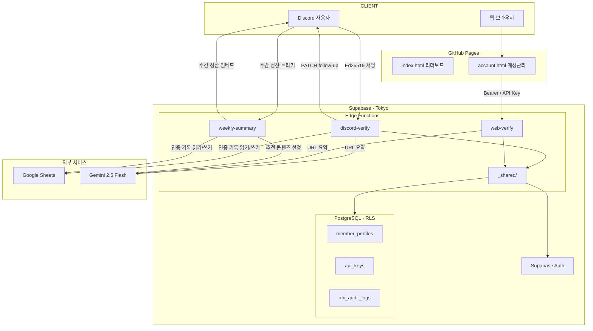

# 너만·알맡 챌린지 자동화 시스템

> "너 만들기만하고, 알고리즘에 맡겨" — 12주 콘텐츠 제작 챌린지

[](https://github.com/ggplab/content_designer_challenge/actions/workflows/ci.yml)

## 아키텍처

> 전체 다이어그램 (시퀀스 · 컴포넌트 · DB 스키마) → **[docs/architecture.md](docs/architecture.md)**



정적 대시보드(`web/`)는 GitHub Pages로 배포됩니다. 참가자는 Discord `#챌린지-인증` 채널에서 `/인증`으로만 제출합니다.
`web-verify`는 공개 브라우저용이 아닌 서버 대 서버 자동화 전용입니다.

## 챌린지 일정

| 기간 | 내용 |
|------|------|
| 2026-02-23 ~ 03-01 | 준비기간 (목표/KPI/플랫폼 제출) |
| 2026-03-02 ~ 05-23 | 발행기간 (12주) |

## 디렉토리 구조

```
content_designer_challenge/
├── supabase/
│   └── functions/
│       ├── _shared/                  ← 공통 모듈
│       │   ├── cors.ts               ← CORS, HTTP 응답 헬퍼
│       │   ├── crypto.ts             ← 해싱, API 키 생성
│       │   ├── google-auth.ts        ← Google Service Account OAuth
│       │   ├── platform.ts           ← 플랫폼 분류, 메달 부여
│       │   ├── session.ts            ← 토큰 추출, 세션 유저
│       │   ├── sheets.ts             ← Google Sheets HTTP 헬퍼
│       │   ├── supabase.ts           ← Supabase 클라이언트 생성
│       │   └── week.ts               ← 주차 계산
│       ├── discord-verify/           ← Discord 인터랙션 처리
│       │   ├── index.ts              ← controller (서명 검증, 라우팅)
│       │   ├── verification.ts       ← 인증 처리 오케스트레이터
│       │   └── services/
│       │       ├── discord.ts        ← follow-up 메시지
│       │       ├── modal.ts          ← 모달 빌더
│       │       ├── sheets.ts         ← 인증 기록 읽기/쓰기
│       │       └── summarizer.ts     ← OG 파싱, Gemini 요약
│       ├── weekly-summary/           ← 주간 정산 자동화
│       │   ├── index.ts              ← controller
│       │   ├── summary.ts            ← 정산 오케스트레이터
│       │   └── services/
│       │       ├── discord.ts        ← 멤버 조회, 임베드 전송
│       │       ├── gemini.ts         ← 추천 콘텐츠 선정
│       │       ├── sheets.ts         ← 인증 기록 읽기
│       │       └── url.ts            ← URL 단축
│       ├── web-verify/               ← 서버 전용 자동화 엔드포인트
│       ├── claim-member-profile/
│       ├── create-api-key/
│       ├── list-api-keys/
│       └── revoke-api-key/
├── tests/                            ← 유닛 테스트 (deno test)
│   ├── discord-verify/
│   │   └── services/
│   ├── weekly-summary/
│   │   └── services/
│   └── shared/
├── web/
│   ├── index.html                    ← 공개 대시보드
│   ├── account.html                  ← 로그인 / API 키 관리 페이지
│   ├── account.js
│   ├── app-config.js                 ← Supabase 공개 설정
│   ├── dashboard-data.js
│   └── members.json
├── docs/
│   ├── architecture.md
│   └── ...
├── config/
│   └── challenge_config.json
├── secrets/                          ← .gitignore (SA JSON 등)
├── deprecated/
│   └── n8n/                          ← 구버전 n8n 워크플로우
├── CLAUDE.md
└── README.md
```

## 주요 설정

| 항목 | 값 |
|------|-----|
| Supabase Project | tcxtcacibgoancvoiybx |
| Edge Function URL | `https://tcxtcacibgoancvoiybx.supabase.co/functions/v1/discord-verify` |
| Dashboard | `https://ggplab.github.io/content_designer_challenge` |
| Account Page | `https://ggplab.github.io/content_designer_challenge/account.html` |
| Discord 서버 ID | 1473868607640305889 |
| Discord 채널 | #챌린지-인증 (1473868708261658695) |
| Google Sheet ID | 1CKyVexXErtbkAVm6I-30fh3tei6J4B9HtCjq0-fmvvU |

## 배포

```bash
supabase functions deploy discord-verify --project-ref tcxtcacibgoancvoiybx --no-verify-jwt
supabase functions deploy weekly-summary --project-ref tcxtcacibgoancvoiybx --no-verify-jwt
supabase functions deploy web-verify --project-ref tcxtcacibgoancvoiybx --no-verify-jwt
```

## 로컬 준비

### 필수 도구

- `git`
- `supabase` CLI
- `deno` 2.x 이상

### 설치

```bash
git clone https://github.com/ggplab/content_designer_challenge.git
cd content_designer_challenge
```

### 환경변수 설정

로컬 테스트용 env 파일을 만듭니다. 절대 커밋하지 않습니다.

```bash
# supabase/.env.local
DISCORD_PUBLIC_KEY=
DISCORD_APPLICATION_ID=
DISCORD_BOT_TOKEN=
DISCORD_GUILD_ID=
DISCORD_WEEK_SUMMARY_CHANNEL_ID=
GEMINI_API_KEY=
GEMINI_MODEL=gemini-2.5-flash          # 선택, 기본값 gemini-2.5-flash
GOOGLE_SHEET_ID=
GOOGLE_SHEET_TAB=시트1                  # 선택, 기본값 시트1
GCP_SERVICE_ACCOUNT_JSON=
```

프로덕션 시크릿 등록:

```bash
supabase secrets set DISCORD_PUBLIC_KEY=...
supabase secrets set DISCORD_APPLICATION_ID=...
supabase secrets set DISCORD_BOT_TOKEN=...
supabase secrets set DISCORD_GUILD_ID=...
supabase secrets set DISCORD_WEEK_SUMMARY_CHANNEL_ID=...
supabase secrets set GEMINI_API_KEY=...
supabase secrets set GOOGLE_SHEET_ID=...
supabase secrets set GCP_SERVICE_ACCOUNT_JSON=...
supabase secrets set WEB_VERIFY_ALLOWED_ORIGINS=https://ggplab.github.io/content_designer_challenge,https://ggplab.github.io,http://localhost:4173
```

## 로컬 테스트

### 유닛 테스트 (외부 의존 없음)

```bash
deno test tests/ --allow-all --ignore="tests/dashboard-data.test.js"
```

### 방법 1 — Supabase CLI (권장, 실제 배포 환경과 동일)

Docker가 필요합니다.

```bash
# 로컬 Supabase 스택 실행
supabase start

# 함수 serve (별도 터미널)
supabase functions serve discord-verify --env-file supabase/.env.local --no-verify-jwt
supabase functions serve weekly-summary --env-file supabase/.env.local --no-verify-jwt

# 테스트
curl -X POST http://localhost:54321/functions/v1/weekly-summary
```

### 방법 2 — Deno 직접 실행 (Docker 없이 빠르게)

`weekly-summary`처럼 단순 POST 함수에 적합합니다.

```bash
# env 로드 후 실행 (포트 8000)
source supabase/.env.local  # 또는 export로 개별 설정
deno run --allow-all supabase/functions/weekly-summary/index.ts

# 테스트
curl -X POST http://localhost:8000
```

> **주의:** `discord-verify`는 `EdgeRuntime.waitUntil()`을 사용하므로 Deno 직접 실행 시 백그라운드 처리가 동작하지 않습니다. Supabase CLI 방식을 권장합니다.

### discord-verify 테스트 팁

Discord 서명 검증이 있어 일반 curl로는 `401`이 납니다. Discord Dev Portal의 Interactions Endpoint에 로컬 URL을 등록하거나 (`ngrok` 등으로 터널링), 서명 검증 로직을 임시로 bypass하여 로직만 확인하는 방법을 사용합니다.

## 인증 방식

- 참가자 제출: Discord `#챌린지-인증` 채널에서 `/인증`
- 공개 대시보드: GitHub Pages 정적 사이트
- 서버 자동화 연동: `web-verify`를 서버 대 서버 방식으로 호출

브라우저, n8n 클라이언트, 공개 문서에 `Authorization: Bearer ...` 형태의 고정 키를 노출하지 마세요.

## 기여 방법

로컬에서 feature 브랜치를 따서 작업하고 로컬 main에 머지 후 푸시합니다. 리모트에 feature 브랜치를 올리지 않아도 됩니다.

```bash
git checkout -b feat/my-change
# 작업 후
git checkout main && git merge feat/my-change
git push origin main
git branch -d feat/my-change
```

PR에는 아래 항목을 포함해 주세요.

- 변경 목적
- 영향 범위 (`docs`, `supabase/functions`, `config` 등)
- 검증 방법

## 보안 정책

- API 키, 토큰, 서비스 계정 JSON은 절대 커밋하지 않습니다.
- 민감정보는 `secrets/`, `.env*`, 키 파일 패턴으로 `.gitignore` 처리되어 있습니다.
- 이미 유출된 키는 히스토리 정리 전에 반드시 폐기하고 재발급하세요.
- `web-verify`는 공개 웹 UI에서 직접 호출하지 않습니다.
- 자동화 엔드포인트는 허용 Origin, rate limit, URL allowlist를 함께 운영합니다.

취약점 제보는 공개 이슈 대신 비공개 채널로 전달해 주세요.

## TODO

- [ ] Discord 응답 메시지 URL 단축

## License

MIT License. 자세한 내용은 `LICENSE`를 참고하세요.

## Report

- 시스템 아키텍처 다이어그램: `docs/architecture.md`
- 기술 작업 리포트 (2026-02-23): `docs/technical_report_2026-02-23.md`
- 웹 로그인/API 키 설계안: `docs/web-auth-api-key-plan.md`
- 웹 로그인/API 키 배포 체크리스트: `docs/auth-deploy-checklist.md`
- Discord 업데이트 이력 운영 플레이북: `docs/discord-update-history-playbook.md`
