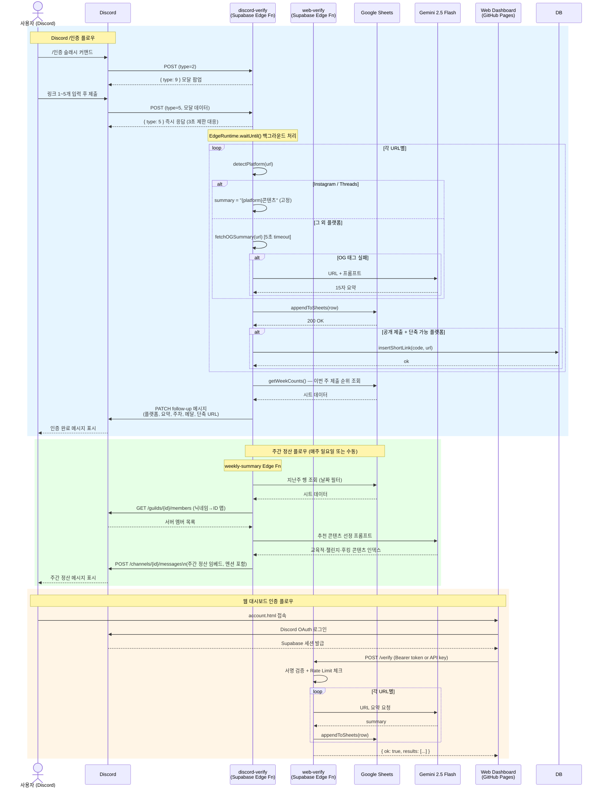
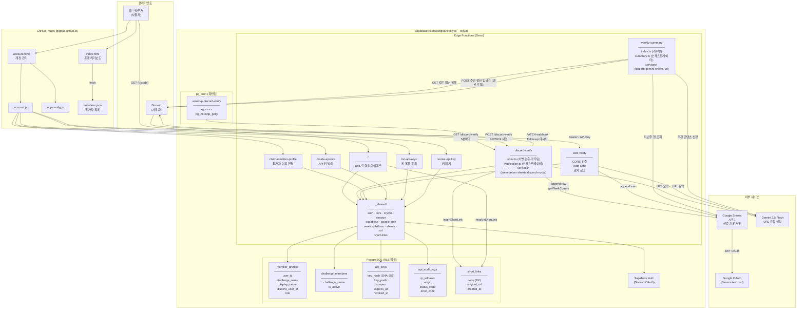
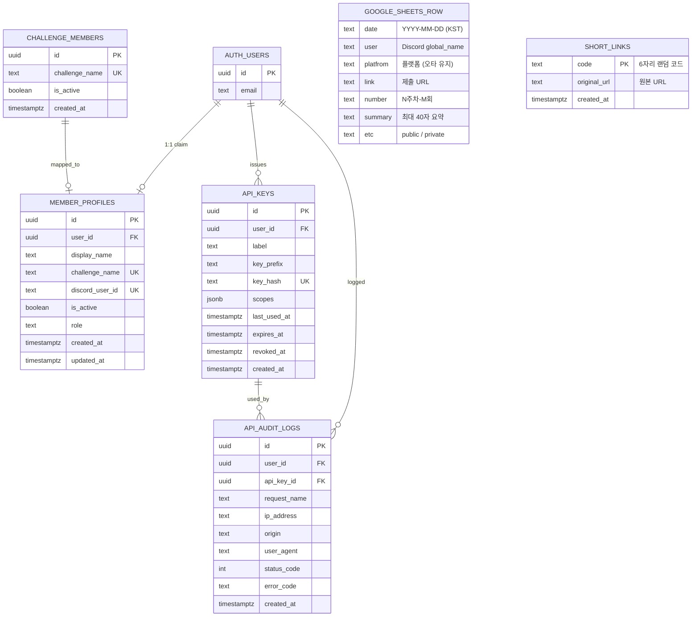

# 시스템 아키텍처 — 너만·알맡 챌린지

> 작성일: 2026-03-17

---

## 1. 전체 시스템 흐름도



---

## 2. 컴포넌트 구조도



---

## 3. 데이터 모델 (DB Schema)



---

## 4. 주요 처리 로직 요약

### 주차 계산
```
발행 시작일: 2026-03-02 (KST)
준비기간: ~ 2026-03-01
1주차: 03-02 ~ 03-08
2주차: 03-09 ~ 03-15
...
12주차: 05-18 ~ 05-23
```

### 메달 부여
```
해당 주차 내 제출 순서 기준:
1번째 → 🥇  |  2번째 → 🥈  |  3번째 → 🥉
```

### URL 요약 우선순위
```
Instagram / Threads: 고정 문자열 "{platform}콘텐츠" (OG fetch · Gemini 호출 없음)
  → 이유: 클라우드 서버 IP 차단으로 429 반환, URL 자체에 내용 정보 없어 Gemini 할루시네이션 발생

그 외 플랫폼:
  1순위: OG 메타 태그 (og:title, twitter:title, <title>) — 5초 timeout
  2순위: Gemini 2.5 Flash — 15자 이내 한국어 요약
```

### 인증 수단 (web-verify)
```
1. Supabase 세션 Bearer 토큰 (Discord OAuth 로그인)
2. API 키 (ggplab_ 접두사, SHA-256 해시 저장)
```
